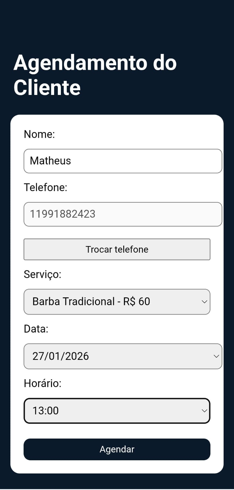
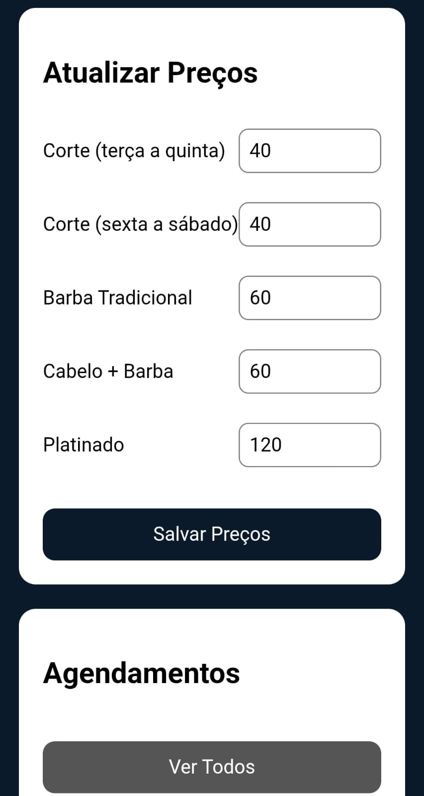

# 💈 Barbearia PWA


## 📸 Screenshots

### Tela inicial


### Agendamento do cliente



### Painel do barbeiro


### Atualização de preços



Aplicação **PWA (Progressive Web App)** desenvolvida para **agendamento de barbearia**, permitindo que clientes escolham **data e horário disponíveis**, com **bloqueio automático de horários ocupados e passados**.


O projeto foi criado com foco em **aprendizado prático**, simulando um sistema real utilizado no dia a dia de barbearias.

---

## 🚀 Funcionalidades

- 📅 Agendamento de horários  
- ⛔ Bloqueio de horários já ocupados  
- ⏰ Bloqueio de horários passados  
- 📱 Funcionamento como **PWA** (instalável no celular)  
- 🔄 Atualização automática do PWA  
- ⚡ Interface rápida e moderna com React + Vite  

---

## 🛠️ Tecnologias Utilizadas

- **React**
- **Vite**
- **JavaScript**
- **PWA (Service Worker)**
- **CSS**
- **ESLint**

---

## 📂 Estrutura do Projeto

```bash
Barbearia-pwa-
├── public
├── src
│   ├── components
│   ├── pages
│   ├── services
│   └── Cliente.jsx
├── scripts
├── index.html
├── package.json
├── vite.config.js
└── README.md
```
---
## ▶️ Como rodar o projeto

### 1️⃣ Clonar o repositório
```bash
git clone https://github.com/Marco471/Barbearia-pwa-.git
```
### 2️⃣ Entrar na pasta do projeto
```bash
cd Barbearia-pwa-
```
### 3️⃣ Instalar as dependências
```bash
npm install
```
### 4️⃣ Rodar o projeto
```bash
npm run dev
```
---

## 📱 PWA

- Pode ser instalado no celular ou computador  
- Funciona offline (dependendo do cache do navegador)  
- Atualização automática configurada  


